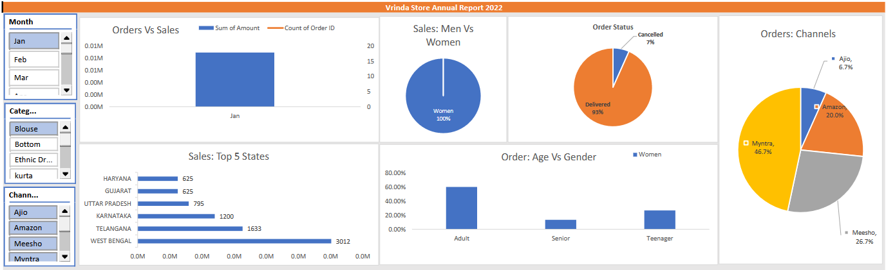

# Vrinda Store Data Analysis (Excel)

## 📊 Project Overview

This project analyzes the sales data of **Vrinda Store** using Microsoft Excel to understand customer purchasing behavior, product demand, and overall sales performance.
The goal is to identify key insights that can help the business improve sales and target the right customers.

---

## 🛠 Tools Used

* Microsoft Excel
* Pivot Tables
* Pivot Charts
* Slicers
* Data Cleaning

---

## 📁 Dataset Information

The dataset contains the following information:

* User ID
* Customer Name
* Gender
* Age Group
* State
* Region
* Occupation
* Marital Status
* Product Category
* Orders
* Sales Amount

Total Records: **11,252 rows**

---

## 🔍 Dataset Sample

| User_ID | Name     | Gender | Age_Group | State     | Occupation  | Orders | Amount |
| ------- | -------- | ------ | --------- | --------- | ----------- | ------ | ------ |
| 1000687 | Neola    | M      | 26-35     | Haryana   | Media       | 2      | 557    |
| 1002718 | Abhishek | M      | 26-35     | Karnataka | IT Sector   | 1      | 555    |
| 1000802 | Marley   | F      | 26-35     | Delhi     | Healthcare  | 1      | 407    |
| 1001425 | Sudevi   | F      | 0-17      | Delhi     | IT Sector   | 1      | 396    |
| 1003032 | Matthias | F      | 26-35     | Delhi     | Hospitality | 3      | 384    |

---

## 📈 Dashboard

---

## 💡 Key Insights

* Women customers contribute more to overall sales compared to men.
* The **26–35 age group** generates the highest number of purchases.
* Top states contributing to sales are **Uttar Pradesh, Maharashtra, and Karnataka**.
* **Amazon, Flipkart, and Myntra** are the major sales channels.
* Most customers purchase products from **Clothing, Food, and Electronics** categories.

---

## 📂 Files in Repository

* Vrinda_Store_Data_Analysis.xlsx → Excel dataset and analysis
* Dashboard.png → Excel dashboard screenshot
* README.md → Project documentation

---

## 🚀 Conclusion

Married women aged **26–35 years** from **Uttar Pradesh, Maharashtra, and Karnataka** working in **IT, Healthcare, and Aviation** sectors are more likely to purchase products from **Food, Clothing, and Electronics** categories.
